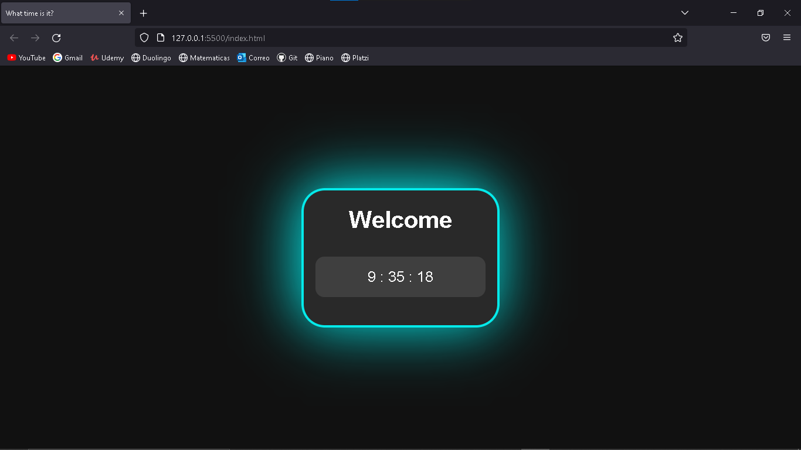
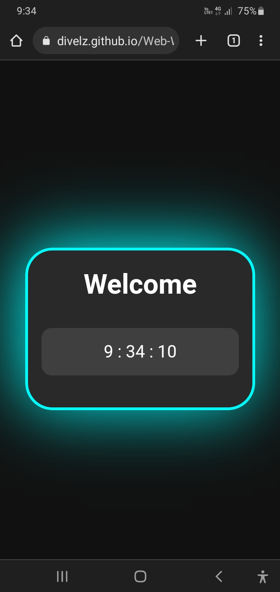

# Web-What-time-is-it

#1 project on the web using html, css, javascript.

Show the time in the browser.

**Image 1**

**Image 2**

link: [Go to the website.](https://divelz.github.io/Web-What-time-is-it/)

**Best regard !!!**

<cite>Author: Francisco Velez</cite>
